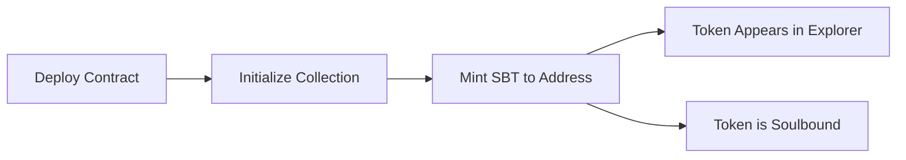

# 🏆 Aptos Soulbound Token (SBT) Contract

A decentralized achievement and credential system built on Aptos blockchain using Token V2 (Token Objects) framework. This contract enables **direct minting of non-transferable NFTs** to any address without requiring recipient setup.

[](https://aptos.dev/)
[](https://move-language.github.io/move/)
[](LICENSE)

## 🎯 Features

- ✅ **Direct Minting**: Mint SBTs to any address without recipient opt-in
- ✅ **True Soulbound**: Non-transferable tokens using Token V2 objects
- ✅ **Achievement System**: Perfect for credentials, badges, and certifications
- ✅ **On-chain Metadata**: Stores recipient and minting timestamp
- ✅ **Explorer Visible**: Tokens appear in Aptos Explorer
- ✅ **Gas Efficient**: Single transaction minting
- ✅ **No TokenStore Required**: Bypasses Token V1 limitations

## 📋 Table of Contents

- [Quick Start](#-quick-start)
- [Installation](#-installation)
- [Usage](#-usage)
- [Contract Functions](#-contract-functions)
- [Examples](#-examples)
- [Deployment](#-deployment)
- [Architecture](#-architecture)
- [Contributing](#-contributing)

## 🚀 Quick Start

### Prerequisites

- [Aptos CLI](https://aptos.dev/tools/aptos-cli-tool/install-aptos-cli/) installed
- Funded Aptos devnet account
- Basic understanding of Move language

### 1. Clone Repository

```bash
git clone https://github.com/yourusername/aptos-sbt-contract.git
cd aptos-sbt-contract
```

### 2. Configure Aptos CLI

```bash
aptos init --profile default
# Follow prompts to create/import account
```

### 3. Fund Your Account

```bash
aptos account fund-with-faucet --profile default
```

### 4. Deploy Contract

```bash
cd custom_sbt
aptos move publish --profile default
```

### 5. Initialize Collection

```bash
aptos move run \
  --function-id 0xYOUR_ADDRESS::sbt::initialize_collection \
  --profile default
```

### 6. Mint Your First SBT

```bash
aptos move run \
  --function-id 0xYOUR_ADDRESS::sbt::mint_sbt \
  --args address:0xRECIPIENT_ADDRESS \
  --profile default
```

## 🛠 Installation

### Method 1: Direct Deployment

1. **Clone the repository:**
   ```bash
   git clone https://github.com/yourusername/aptos-sbt-contract.git
   cd aptos-sbt-contract
   ```

2. **Update contract address in `Move.toml`:**
   ```toml
   [addresses]
   custom_sbt = "YOUR_DEPLOYED_ADDRESS"
   ```

3. **Compile and deploy:**
   ```bash
   cd custom_sbt
   aptos move compile
   aptos move publish --profile default
   ```

### Method 2: Fork and Customize

1. Fork this repository
2. Customize metadata in `sbt.move`:
   ```move
   const COLLECTION_NAME: vector<u8> = b"Your Collection Name";
   const TOKEN_NAME: vector<u8> = b"Your Token Name";
   const TOKEN_DESCRIPTION: vector<u8> = b"Your description";
   ```
3. Deploy to your account

## 📖 Usage

### Core Workflow



### Contract Functions

#### `initialize_collection(creator: &signer)`
**Purpose**: One-time setup to create the SBT collection.

```bash
aptos move run \
  --function-id YOUR_ADDRESS::sbt::initialize_collection \
  --profile default
```

#### `mint_sbt(creator: &signer, recipient: address)`
**Purpose**: Mint a soulbound token directly to any address.

```bash
aptos move run \
  --function-id YOUR_ADDRESS::sbt::mint_sbt \
  --args address:0x1234...5678 \
  --profile default
```

#### `get_sbt_data(token_address: address): (address, u64)` 
**Purpose**: View function to retrieve SBT metadata.

```bash
aptos move view \
  --function-id YOUR_ADDRESS::sbt::get_sbt_data \
  --args address:TOKEN_ADDRESS
```

## 💡 Examples

### Example 1: Academic Credentials

```bash
# Deploy for university diplomas
aptos move run \
  --function-id YOUR_ADDRESS::sbt::mint_sbt \
  --args address:0xgraduate123... \
  --profile university
```

### Example 2: Developer Achievements

```bash
# Award "Hackathon Winner" badge
aptos move run \
  --function-id YOUR_ADDRESS::sbt::mint_sbt \
  --args address:0xdeveloper456... \
  --profile hackathon_org
```

### Example 3: Membership Tokens

```bash
# DAO membership badge
aptos move run \
  --function-id YOUR_ADDRESS::sbt::mint_sbt \
  --args address:0xmember789... \
  --profile dao_admin
```

## 🔧 Configuration

### Customizing Metadata

Edit the constants in `custom_sbt/sources/sbt.move`:

```move
/// Collection and Token Metadata
const COLLECTION_NAME: vector<u8> = b"Developer Badges";
const COLLECTION_DESCRIPTION: vector<u8> = b"Soulbound NFT badges for active contributors";
const COLLECTION_URI: vector<u8> = b"https://your-collection-image.png";

/// Token Metadata  
const TOKEN_NAME: vector<u8> = b"Top Contributor 2025";
const TOKEN_DESCRIPTION: vector<u8> = b"Awarded to outstanding developers";
const TOKEN_URI: vector<u8> = b"https://your-token-image.png";
```

### Current Contract Configuration

- **Collection**: "Developer Badges"
- **Token**: "Top Contributor 2025"
- **Network**: Aptos Devnet
- **Contract Address**: `0xbe2bd85369e1d610bbcd43592515ec4215a1cb30c6358ed84ca0e59d354eb362`

## 🏗 Architecture

### Contract Structure

```
custom_sbt/
├── Move.toml              # Package configuration
└── sources/
    └── sbt.move          # Main contract
```

### Key Components

#### **SBTData Struct**
```move
struct SBTData has key {
    recipient: address,    // Who received the SBT
    minted_at: u64,       // Timestamp when minted
}
```

#### **Token Creation Flow**
1. **Create named token** with unique identifier
2. **Transfer to recipient** while transfers enabled
3. **Disable ungated transfers** (makes it soulbound)
4. **Store metadata** on-chain

### Token V2 Advantages

| Feature | Token V1 | Token V2 (This Contract) |
|---------|----------|--------------------------|
| Direct Minting | ❌ Requires TokenStore | ✅ Works with any address |
| Recipient Setup | ❌ Manual opt-in required | ✅ Automatic |
| Gas Efficiency | ❌ Multiple transactions | ✅ Single transaction |
| Object Model | ❌ Account-based | ✅ Object-based |

## 🧪 Testing

### Deployment Commands

```bash
# Navigate to contract directory
cd custom_sbt

# Compile contract
aptos move compile

# Deploy to devnet
aptos move publish --profile default

# Initialize collection (one-time)
aptos move run \
  --function-id 0xbe2bd85369e1d610bbcd43592515ec4215a1cb30c6358ed84ca0e59d354eb362::sbt::initialize_collection \
  --profile default

# Mint SBT to address
aptos move run \
  --function-id 0xbe2bd85369e1d610bbcd43592515ec4215a1cb30c6358ed84ca0e59d354eb362::sbt::mint_sbt \
  --args address:0x5419be7a72ab6602f039f0e8133df8ff0122eb8e624ebd1603bcdc09e0d41270 \
  --profile default
```

### Test Scenarios

1. **✅ Mint to fresh address** (no previous blockchain interaction)
2. **✅ Mint to existing account** 
3. **✅ Verify non-transferability**
4. **✅ Check metadata accuracy**
5. **✅ Multiple mints to same address**

## 📊 Monitoring

### View on Aptos Explorer

- **Account**: `https://explorer.aptoslabs.com/account/0xbe2bd85369e1d610bbcd43592515ec4215a1cb30c6358ed84ca0e59d354eb362?network=devnet`
- **Transactions**: View individual transaction hashes in explorer

### Query SBT Data

```bash
# Check SBT metadata
aptos move view \
  --function-id 0xbe2bd85369e1d610bbcd43592515ec4215a1cb30c6358ed84ca0e59d354eb362::sbt::get_sbt_data \
  --args address:TOKEN_ADDRESS
```

## 🚀 Deployment Guide

### Step-by-Step Deployment

1. **Prepare environment:**
   ```bash
   aptos init --profile default
   aptos account fund-with-faucet --profile default
   ```

2. **Deploy contract:**
   ```bash
   cd custom_sbt
   aptos move publish --profile default
   ```

3. **Initialize and test:**
   ```bash
   # Initialize collection
   aptos move run --function-id YOUR_ADDRESS::sbt::initialize_collection --profile default
   
   # Test mint
   aptos move run --function-id YOUR_ADDRESS::sbt::mint_sbt --args address:TEST_ADDRESS --profile default
   ```

### Production Checklist

- [ ] Metadata URLs are permanent (IPFS recommended)
- [ ] Contract address updated in Move.toml
- [ ] Sufficient gas funds available
- [ ] Tested on devnet first
- [ ] Access controls implemented (if needed)

## 🔍 How It Works

### **🏗️ Architecture:**
- **Framework**: Uses Aptos Token V2 (Token Objects) instead of legacy Token V1
- **Collection**: "Developer Badges" - container for all SBTs
- **Token Type**: "Top Contributor 2025" - achievement badges

### **🎯 Key Innovations:**

#### **✅ Solves the Original Problem:**
- **No TokenStore initialization** required from recipients
- **No opt-in needed** from recipients  
- **Direct minting** to any Aptos address
- **Bypasses Token V1 limitations** completely

#### **🔒 Soulbound Mechanism:**
1. **Create token** with full transfer capabilities
2. **Transfer to recipient** while transfers are still enabled
3. **Disable ungated transfers** making it permanently non-transferable
4. **Result**: Token is "soulbound" to the recipient

#### **🆔 Unique Token Names:**
- Base: "Top Contributor 2025"
- Appends: " #[timestamp]ID" 
- Example: "Top Contributor 2025 #123456ID"
- Ensures each SBT has a unique identifier

### **🚀 Usage Flow:**
1. **Deploy** contract to Aptos Devnet
2. **Initialize** collection once: `initialize_collection()`
3. **Mint SBTs** to anyone: `mint_sbt(creator, any_address)`
4. **View on Explorer** - tokens appear in recipient accounts
5. **Non-transferable** - recipients cannot move or sell them

## 🤝 Contributing

### Development Setup

1. **Fork the repository**
2. **Create feature branch:**
   ```bash
   git checkout -b feature/your-feature-name
   ```
3. **Make changes and test**
4. **Submit pull request**

### Code Style

- Follow [Move coding conventions](https://move-language.github.io/move/coding-conventions.html)
- Add comments for complex logic
- Include tests for new features
- Update documentation

### Reporting Issues

Please use GitHub Issues for:
- 🐛 Bug reports
- 💡 Feature requests  
- 📖 Documentation improvements
- ❓ Questions

## 📄 License

This project is licensed under the MIT License - see the [LICENSE](LICENSE) file for details.

## 🙏 Acknowledgments

- [Aptos Labs](https://aptos.dev/) for the amazing blockchain platform
- [Move Language](https://move-language.github.io/move/) team
- Community contributors and testers

## 📞 Support

- **Documentation**: [Aptos Developer Docs](https://aptos.dev/)
- **Discord**: [Aptos Discord](https://discord.gg/aptoslabs)
- **Issues**: [GitHub Issues](https://github.com/yourusername/aptos-sbt-contract/issues)

---

### 🎯 Quick Commands Reference

```bash
# Compile
aptos move compile

# Deploy  
aptos move publish --profile default

# Initialize
aptos move run --function-id 0xbe2bd85369e1d610bbcd43592515ec4215a1cb30c6358ed84ca0e59d354eb362::sbt::initialize_collection --profile default

# Mint SBT
aptos move run --function-id 0xbe2bd85369e1d610bbcd43592515ec4215a1cb30c6358ed84ca0e59d354eb362::sbt::mint_sbt --args address:RECIPIENT --profile default

# View SBT
aptos move view --function-id 0xbe2bd85369e1d610bbcd43592515ec4215a1cb30c6358ed84ca0e59d354eb362::sbt::get_sbt_data --args address:TOKEN_ADDRESS
```

**Happy Building! 🚀**
